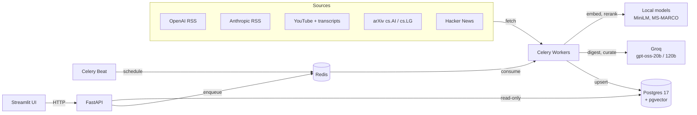

# Lodestar

**A multi-stage retrieval engine for AI news.**

Lodestar ingests AI news from five sources and ranks it against a reader's profile using hybrid lexical + dense retrieval, multiple-instance pooling, cross-encoder re-ranking and a final LLM curation pass. It is written entirely in Python and deployed as a containerised multi-service system.


> 🚧 **Under active development.** The project foundation is complete. The retrieval engine is next. See the [roadmap](#roadmap).

---

## Why this exists

Most AI-news summarisers send every article to an LLM and ask it to rank them. That approach is expensive and slow, and there's no way to measure how good the ranking is.

Lodestar runs deterministic, testable retrieval first. By the time an LLM is involved, the corpus has already been narrowed to a shortlist of about 20 candidates. Each stage before that is a pure function, so it can be unit-tested, ablated and scored with standard IR metrics (nDCG, MRR, Recall@k).

## Architecture



**Design rule:** the UI never touches the database, and nothing writes synchronously. Streamlit is an HTTP client of FastAPI. FastAPI reads from Postgres and enqueues work. Only the Celery workers write.

## Retrieval pipeline

| Stage | Technique | Purpose |
|---|---|---|
| 1a | Postgres `tsvector` + GIN, BM25 | Exact-term recall: model names, versions, identifiers |
| 1b | pgvector HNSW over MiniLM embeddings | Semantic recall: paraphrase, synonyms |
| 2 | Reciprocal Rank Fusion | Merge both lists by rank, so the two retrievers' scores never need calibrating against each other |
| 3 | Multiple-instance pooling | Collapse chunk scores to document scores (MaxP, Top-k mean, LogSumExp, Noisy-OR) |
| 4 | Cross-encoder re-ranking | Joint query–passage scoring on the top 50 |
| 5 | Recency decay, source authority, MMR | Freshness and diversity; near-duplicate collapse |
| 6 | LLM curation (Groq) | Personalised final ranking with a written justification per item |

## Tech stack

| Layer | Tools |
|---|---|
| Language | Python 3.11 |
| API | FastAPI, Pydantic v2 |
| Workers | Celery, Redis, Celery Beat, Flower |
| Storage | PostgreSQL 17, pgvector, SQLAlchemy 2.0, Alembic |
| Retrieval / ML | sentence-transformers, cross-encoders, rank-bm25, NumPy |
| LLM | Groq (`openai/gpt-oss-20b`, `openai/gpt-oss-120b`), provider-agnostic adapter |
| UI | Streamlit |
| Observability | structlog (JSON), Prometheus, Grafana |
| Delivery | Docker (multi-stage), Docker Compose, GitHub Actions, GHCR, Helm |
| Quality | pytest, Hypothesis, Ruff, mypy (strict), pre-commit |

## Quickstart

Requires Docker and [uv](https://docs.astral.sh/uv/).

```bash
git clone https://github.com/your-kafka/AI-news-aggregator.git
cd AI-news-aggregator

cp .env.example .env     # then set POSTGRES_PASSWORD to anything you like
uv sync                  # install exact versions from uv.lock
make up                  # start Postgres 17 + pgvector, wait until healthy
make help                # list every available command
```

## Roadmap

| Phase | Scope | Status |
|---|---|---|
| P0 | Tooling, typed settings, structured logging, local Postgres | ✅ Done |
| P1 | Domain models, SQLAlchemy 2.0 ORM, Alembic migrations | ⏳ Next |
| P2 | Plugin-based ingestion for five sources | ⬜ |
| P3 | Chunking, embeddings, HNSW index | ⬜ |
| P4 | Six-stage retrieval engine | ⬜ |
| P5 | Evaluation harness: nDCG, MRR, Recall@k, ablations, CI quality gate | ⬜ |
| P6 | LLM layer: provider adapter, model routing, caching, retries | ⬜ |
| P7 | FastAPI service | ⬜ |
| P8 | Celery workers, Beat scheduler, Flower | ⬜ |
| P9 | Streamlit UI | ⬜ |
| P10 | Multi-stage Docker images, multi-arch builds | ⬜ |
| P11 | CI/CD: GHCR, image scanning, signing, deploy with rollback | ⬜ |
| P12 | Prometheus/Grafana, Kubernetes + Helm | ⬜ |

## Project layout

```
lodestar/
└── core/
    ├── config.py     typed settings, validated at startup (pydantic-settings)
    └── logging.py    structured logs: coloured locally, JSON in production
docker-compose.yml    local Postgres 17 + pgvector with healthcheck
Makefile              every project command; run `make help`
pyproject.toml        dependencies and tool configuration
```

## Engineering principles

- **Config lives in the environment.** No `os.getenv` outside `core/config.py`. Every setting is typed and validated when the app starts, and secrets are wrapped in `SecretStr` so they never appear in logs.
- **Fail loudly at startup, never silently at runtime.** A missing password stops the app from booting. It doesn't turn into a failed query hours later.
- **Logs are data, not sentences.** Events carry structured fields and a bound `run_id`, so one pipeline run can be filtered out of interleaved logs.
- **Reproducible everywhere.** Dependencies are pinned in `uv.lock`, container images are pinned by tag, and CI runs the same `make check` you run locally.

## Acknowledgements

The source feeds (RSS endpoints and transcript handling) are adapted from [datalumina/ai-news-aggregator](https://github.com/datalumina/ai-news-aggregator). Everything from chunking onwards is original to this project.

## Author

**Ramkrishna Rathore**
📧 [luckyrathore70495@kgpian.iitkgp.ac.in](mailto:luckyrathore70495@kgpian.iitkgp.ac.in)
